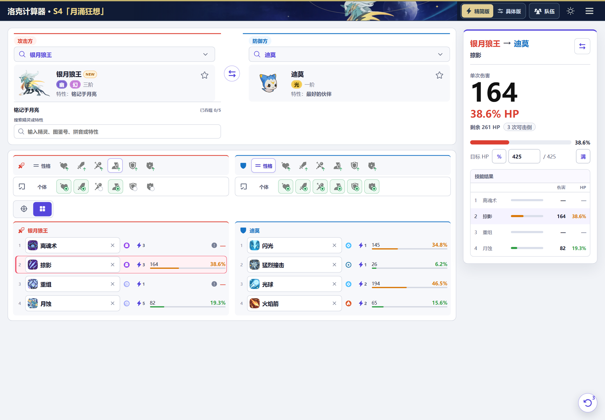

# RocoCalc — Roco Kingdom Damage Calculator

[简体中文](README.md) · **English**

RocoCalc (Roco Calculator) is an unofficial PvP damage calculator and team-planning tool for the Chinese version of Roco Kingdom, **洛克王国：世界**. Select both Jinies and their skills to compare damage, its share of HP and remaining HP.

**Use the calculator: [https://rococalc.top/](https://rococalc.top/)**

[English guide](https://rococalc.top/en/) · [Chinese guide](https://rococalc.top/guide/) · [Windows download](https://github.com/Evenstar-tools/roco-calculator/releases/latest) · [Report an issue](https://github.com/Evenstar-tools/roco-calculator/issues/new/choose)

> The calculator UI and Jini names are Chinese. RocoCalc currently uses **China-server S4 data** (国服 S4「月涌狂想」). The English guide explains the tools; it does not translate the calculator interface or data. **International-server stats and rules have not been verified.**



## Calculate damage in three steps

1. Select the attacking and defending Jinies using their Chinese names.
2. Choose a single skill or four-skill setup. Use compact mode (精简版) for quick comparisons, or detailed mode (具体版) to adjust personality, individual stat values, skill power, hit count and battle conditions.
3. Read the damage, HP percentage and remaining HP. Use advanced options (高级选项) to inspect the formulas and conditions.

The same inputs produce the same result. Check the page's warnings about unconfirmed base stats, unsupported effects and unresolved conditions before treating a theoretical result as a confirmed battle outcome.

## Tools for PvP preparation

| Tool | What it does |
| --- | --- |
| Damage calculator | Compare both attack directions, single skills or four skills; adjust conditions and review the formula steps. |
| Teams (队伍) | Save multiple six-member teams with four-skill configurations and load a member into either side. Review type weaknesses, skill coverage and matchups. |
| Skill search (技能检索) | Search Chinese skill names or effect descriptions, filter by type, category and season, and check which Jini families can learn a skill. |
| Type lookup (属性查询) | Check defensive resistances and weaknesses, and offensive coverage for one or two types. Type relationships alone do not replace a full damage calculation. |
| Speed and durability rankings (速度线排行／耐久排行) | Compare configured values, templates and selected metrics under the stated assumptions. |
| Slot-order simulator (传动计算器) | Review four-skill order changes turn by turn. This is not a complete battle simulator. |
| [KO threshold tool (电鹿斩杀线)](https://rococalc.top/dianlu/) | Compare current damage and minimum trait stacks for a single-skill knockout, with an optional follow-up calculation and warnings for unsupported survival effects. |

Open Teams at the top of the calculator. The other reference tools are in the toolbox (工具箱); the KO tool also has its own page. The [English guide](https://rococalc.top/en/) includes the Chinese control labels, tool locations and five FAQs.

The current S4 snapshot includes **622 Jini forms** and **581 skills**. Forms with unconfirmed base stats retain a notice. Individual configurations are stored locally and restored when you switch Jinies; they are not synced through an account.

## Web, Windows and WeChat

- **Web:** use [rococalc.top](https://rococalc.top/) on a phone or computer. The web app also supports PWA use.
- **Windows:** download the versioned installer from [GitHub Releases](https://github.com/Evenstar-tools/roco-calculator/releases/latest). It bundles the current season's snapshot and local assets for offline use.
- **WeChat:** the mini-program entry code is in the [Chinese README](README.md#微信小程序).

Available installers and source versions are separate: a merged commit or Git tag does not mean a new installer has been published. Check the actual assets on the release page. See [version records (Chinese)](docs/releases/README.md) and the [changelog (Chinese)](CHANGELOG.md) for details.

## AI and command-line use

The project includes a JSON-only CLI that reuses the calculator's core and local snapshot without a browser or network service. With Node.js 22 or later, run these commands from the repository root:

```powershell
npm ci
npm run -s cli -- meta
npm run -s cli -- schema
```

See the [CLI handoff (Chinese)](docs/maintenance/ai-cli-handoff.md) for calculation inputs, name lookup and explanations, and the [project Skill](.agents/skills/rock-calculator-cli/SKILL.md) for AI usage rules. The CLI can reproduce and explain the shared core's result; it is not an independent validation of the underlying formulas.

## Report data or calculation issues

Open a [GitHub issue](https://github.com/Evenstar-tools/roco-calculator/issues/new/choose) with both Jinies, skills, configurations, enabled conditions and the expected result. The [calculation rules (Chinese)](docs/damage-calculation-human-readable.md) explain the assumptions and rounding.

## Sources and license

Data and artwork primarily reference the [洛克王国：世界 BWIKI](https://wiki.biligame.com/rocom/). The project also acknowledges [lovepvp.top](https://lovepvp.top/) and [Roco Showdown's calculation reference](https://rocopvp.tzrain.wiki/battle-use-guide) for rule research. These reference pages are not runtime dependencies.

Code is covered by the [MIT License](LICENSE). BWIKI-derived material covered by its license is shared under [CC BY-NC-SA 4.0](https://creativecommons.org/licenses/by-nc-sa/4.0/). The code license does not grant rights to game assets, trademarks or other third-party content. See the [third-party notices (Chinese)](docs/legal/THIRD_PARTY_NOTICES.md) and the [full Chinese statement](README.md#许可证与声明).

RocoCalc is an unofficial player tool and is not affiliated with or endorsed by the game developers, BWIKI or the reference sites.
