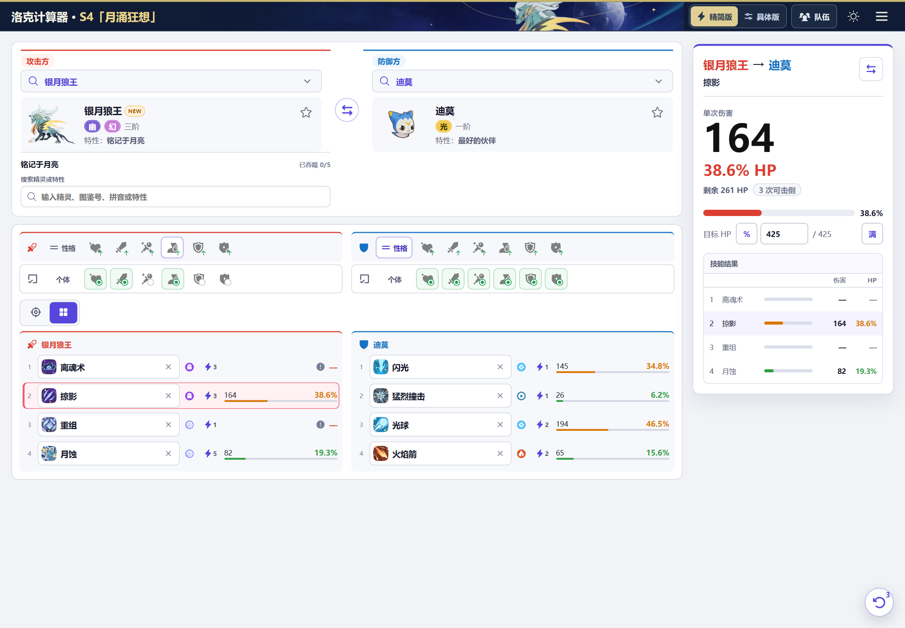

  

<h1 align="center">洛克计算器</h1>

  《洛克王国：世界》PVP 伤害计算工具 
  选好双方精灵和技能，即可快速查看伤害结果。

  
  
  
  

  <a href="https://rococalc.top/"><strong>打开官方在线版</strong></a>
  · <a href="https://github.com/Evenstar-tools/roco-calculator/releases/latest"><strong>下载最新 Windows 版</strong></a>

  最新发布：<a href="https://github.com/Evenstar-tools/roco-calculator/releases/tag/v1.6.3">v1.6.3</a> · 更新于 2026-08-31　｜　数据支持：S3-季中

## 微信小程序

使用微信扫码打开：

  

## 主要能力

- **即时双选**：左右选择攻防精灵，四个技能伤害同步显示。
- **确定性计算**：不显示随机区间，配置变化后立即重算。
- **双向对比**：攻击方与防御方技能均可快捷查看对方伤害。
- **完整配置**：提供精简版与具体版，支持性格、六维个体、威力、连击和触发条件。
- **技能规则**：覆盖动态威力、条件触发、层数特性和手动覆盖。
- **公式核对**：高级选项用四行中文算式展示技能威力、显示威力、单段取整与总伤害。
- **配置记忆**：精灵配置自动保存在本机，切换后按精灵恢复。
- **队伍预设**：支持多支六人队伍、四技能配置及攻防方快捷载入。
- **离线可用**：内置当前赛季快照和本地素材，可作为网页、PWA 或 Windows 桌面应用运行。

当前数据快照包含 **594 个精灵形态**与 **553 个技能**。

## 操作流程

1. 选择攻击方和防御方精灵。
2. 在精简版中选择增益方向与个体加点；需要精确配置时切换具体版。
3. 选择单技能或四技能，直接读取伤害、HP 占比与剩余生命。

## 使用入口

- [官方在线版：rococalc.top](https://rococalc.top/)
- [Windows 安装包与历史版本](https://github.com/Evenstar-tools/roco-calculator/releases)
- [提交问题或建议](https://github.com/Evenstar-tools/roco-calculator/issues/new/choose)

## 版本管理

- [最新 Release](https://github.com/Evenstar-tools/roco-calculator/releases/latest) 是 Windows 安装包的下载入口。
- [版本记录与下载](docs/releases/README.md) 说明当前可下载版本、源码版本与历史入口。
- [更新记录](CHANGELOG.md) 说明每个版本带来的变化。

## 规则说明

伤害结果会按双方精灵、技能、性格、个体、威力和战斗条件逐项计算；相同配置会得到相同结果。
需要核对公式、取整和特殊条件时，可查看 [计算规则说明](docs/damage-calculation-human-readable.md)。

## 鸣谢与参考

- 数据与美术资料主要参考 [洛克王国：世界 BWIKI](https://wiki.biligame.com/rocom/)。
- 感谢 [lovepvp.top](https://lovepvp.top/) 和 [Roco Showdown 战斗模拟计算原理](https://rocopvp.tzrain.wiki/battle-use-guide) 对规则整理与核对方式的长期积累。

参考页面仅用于资料核验和规则研究，不作为本项目的运行时依赖。

## 许可证与声明

本仓库代码的许可和版权署名以 [MIT License](LICENSE) 为准，现为 `Copyright (c) 2026 zhangzeyu99-web`。MIT 只适用于该许可所覆盖的代码，不授予任何游戏素材、商标、第三方页面、第三方数据或美术资源的使用权。

《洛克王国：世界》相关的游戏名称、角色、图像、图标、数据和商标，权利归原权利人所有（包括腾讯、魔方工作室群及相应权利主体）。本项目是非官方玩家工具，与上述主体、BWIKI 及参考站不存在隶属、代理或授权关系。

如果你复制、改编或发布本仓库内容，请先区分代码和第三方内容：不得因为获得了 MIT 代码就照搬游戏素材、品牌元素、BWIKI 受许可内容，或 lovepvp.top、Roco Showdown 等参考站的原创代码、页面设计和自建资料。尤其是用于商业产品、收费服务、广告变现或再分发前，应取得相应权利人的许可，并保留必要的署名和许可证声明；否则可能产生侵权风险和相应责任。

完整的来源、归属与使用边界见 [第三方内容与权利声明](docs/legal/THIRD_PARTY_NOTICES.md)。
