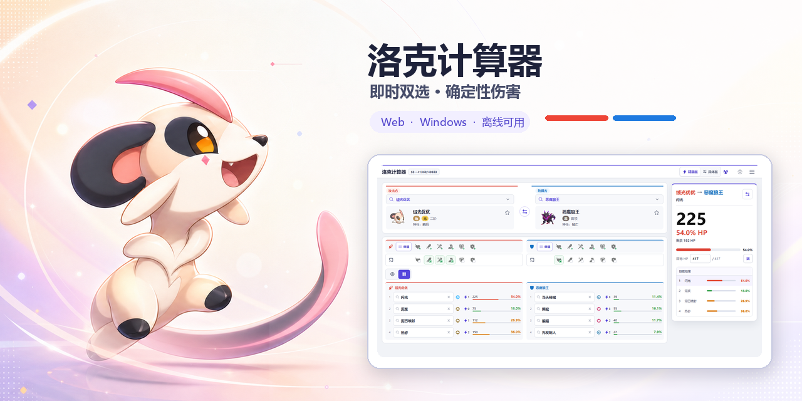

<p align="center">
  
</p>

<h1 align="center">洛克计算器 · RocoCalc</h1>

<p align="center">
  <strong>简体中文</strong> · <a href="README.en.md">English</a>
</p>

<p align="center">
  《洛克王国：世界》PVP 伤害计算与队伍工具<br>
  Roco Calculator — a Roco Kingdom damage calculator for China-server S4.<br>
  选好双方精灵和技能，即可快速查看伤害结果。
</p>

<p align="center">
  <a href="https://rococalc.top/"></a>
  <a href="https://github.com/Evenstar-tools/roco-calculator/releases/latest"></a>
</p>

<p align="center">
  <a href="https://rococalc.top/"><strong>在线计算器：rococalc.top</strong></a><br>
  <a href="https://rococalc.top/guide/">中文使用说明</a>
  · <a href="https://rococalc.top/en/">English guide</a>
  · <a href="https://github.com/Evenstar-tools/roco-calculator/releases/latest">Windows 电脑版</a>
  · <a href="https://github.com/Evenstar-tools/roco-calculator/issues/new/choose">问题与建议</a>
</p>

<p align="center">
  <sub>当前赛季：国服 S4「月涌狂想」　｜　<a href="docs/releases/README.md">源码与可下载版本</a></sub>
</p>

RocoCalc 是非官方玩家工具。当前计算器界面和精灵资料为中文，使用《洛克王国：世界》国服 S4 数据。[英文指南](https://rococalc.top/en/) 提供操作说明，并非计算器的完整英语版；国际服数值和规则尚未核实，不能据此声称已适配国际服。


## 微信小程序

使用微信扫码打开：

<p align="center">
  
</p>

## 主要能力

- **即时双选**：左右选择攻防精灵，四个技能伤害同步显示。
- **确定性计算**：不显示随机区间，配置变化后立即重算。
- **双向对比**：攻击方与防御方技能均可快捷查看对方伤害。
- **完整配置**：提供精简版与具体版，支持性格、六维个体、威力、连击和触发条件。
- **技能规则**：覆盖动态威力、条件触发、层数特性和手动覆盖。
- **公式核对**：高级选项用四行中文算式展示技能威力、显示威力、单段取整与总伤害。
- **配置记忆**：精灵配置自动保存在本机，切换后按精灵恢复。
- **队伍预设**：支持多支六人队伍、四技能配置及攻防方快捷载入。
- **资料查询**：技能检索、属性查询、速度线与耐久排行，帮助核对学习关系、属性克制与配置差异。
- **专项工具**：电鹿斩杀线与传动技能顺序模拟；适用条件和未支持效果以页面提示为准。
- **离线可用**：内置当前赛季快照和本地素材，可作为网页、PWA 或 Windows 桌面应用运行。

当前 S4 数据快照包含 **622 个精灵形态**与 **581 个技能**。种族值未确认的形态仍保留占位说明。

## 操作流程

1. 选择攻击方和防御方精灵。
2. 在精简版中选择增益方向与个体加点；需要精确配置时切换具体版。
3. 选择单技能或四技能，直接读取伤害、HP 占比与剩余生命。

## 使用入口

| 你想做什么 | 入口 |
| --- | --- |
| 计算伤害、配置队伍与使用工具箱 | [在线计算器：rococalc.top](https://rococalc.top/) |
| 查看三步入门、工具用途与常见问题 | [中文指南](https://rococalc.top/guide/) · [English guide](https://rococalc.top/en/) |
| 计算电鹿斩杀线 | [电鹿斩杀线工具](https://rococalc.top/dianlu/) |
| 下载 Windows 安装包 | [最新 Release](https://github.com/Evenstar-tools/roco-calculator/releases/latest) |
| 查看历史版本 | [全部 Releases](https://github.com/Evenstar-tools/roco-calculator/releases) |
| 反馈资料或计算问题 | [GitHub Issues](https://github.com/Evenstar-tools/roco-calculator/issues/new/choose) |

反馈计算问题时，请附上双方精灵、技能、配置、启用条件与预期结果；这样更容易复现同一组输入。

## 版本管理

- [最新 Release](https://github.com/Evenstar-tools/roco-calculator/releases/latest) 是 Windows 安装包的下载入口。
- [版本记录与下载](docs/releases/README.md) 说明当前可下载版本、源码版本与历史入口。
- [更新记录](CHANGELOG.md) 说明每个版本带来的变化。

## 规则说明

伤害结果会按双方精灵、技能、性格、个体、威力和战斗条件逐项计算；相同配置会得到相同结果。
需要核对公式、取整和特殊条件时，可查看 [计算规则说明](docs/damage-calculation-human-readable.md)。

## AI 与命令行调用

项目提供复用同一计算核心的纯 JSON CLI，使用本地数据快照，无需启动网页或调用网络服务。Node.js 22 或更高版本下，在仓库根目录安装依赖并查看数据与输入契约：

```powershell
npm ci
npm run -s cli -- meta
npm run -s cli -- schema
```

计算与解释的输入方式见 [AI CLI 交接说明](docs/maintenance/ai-cli-handoff.md)；项目代理使用规则见 [rock-calculator-cli Skill](.agents/skills/rock-calculator-cli/SKILL.md)。CLI 可以复算并解释同一核心的结果，不能代替对核心公式的独立验证。

## 鸣谢与参考

- 数据与美术资料主要参考 [洛克王国：世界 BWIKI](https://wiki.biligame.com/rocom/)。
- 感谢 [lovepvp.top](https://lovepvp.top/) 和 [Roco Showdown 战斗模拟计算原理](https://rocopvp.tzrain.wiki/battle-use-guide) 对规则整理与核对方式的长期积累。

本项目已对 BWIKI 来源数据进行抓取、结构化、校验、纠错及补充。源自 BWIKI、且受其许可覆盖的数据整理和改编部分依据 [CC BY-NC-SA 4.0](https://creativecommons.org/licenses/by-nc-sa/4.0/deed.zh-hans) 共享。其他参考页面仅用于资料核验和规则研究，不作为本项目的运行时依赖。

## 许可证与声明

本仓库代码的许可和版权署名以 [MIT License](LICENSE) 为准，现为 `Copyright (c) 2026 zhangzeyu99-web`。MIT 只适用于该许可所覆盖的代码，不授予任何游戏素材、商标、第三方页面、第三方数据或美术资源的使用权。

《洛克王国：世界》相关的游戏名称、角色、图像、图标、数据和商标，权利归原权利人所有（包括腾讯、魔方工作室群及相应权利主体）。本项目是非官方玩家工具，与上述主体、BWIKI 及参考站不存在隶属、代理或授权关系。

如果你复制、改编或发布本仓库内容，请先区分代码和第三方内容：不得因为获得了 MIT 代码就照搬游戏素材、品牌元素、BWIKI 受许可内容，或 lovepvp.top、Roco Showdown 等参考站的原创代码、页面设计和自建资料。尤其是用于商业产品、收费服务、广告变现或再分发前，应取得相应权利人的许可，并保留必要的署名和许可证声明；否则可能产生侵权风险和相应责任。

完整的来源、归属与使用边界见 [第三方内容与权利声明](docs/legal/THIRD_PARTY_NOTICES.md)。
